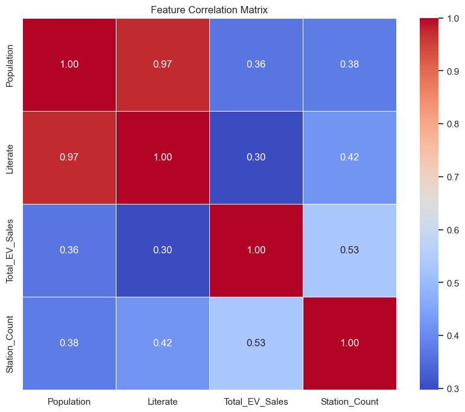
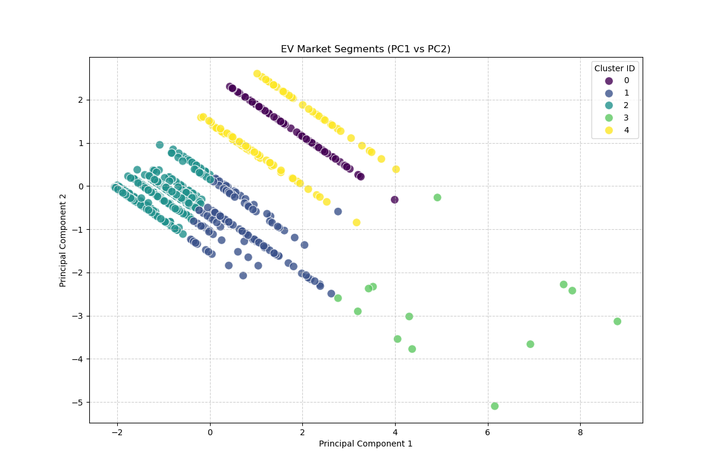
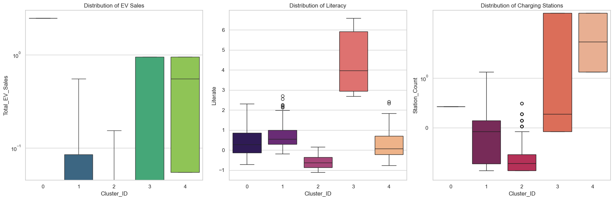
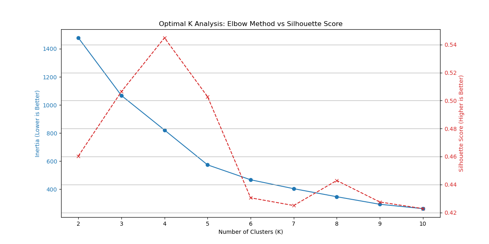
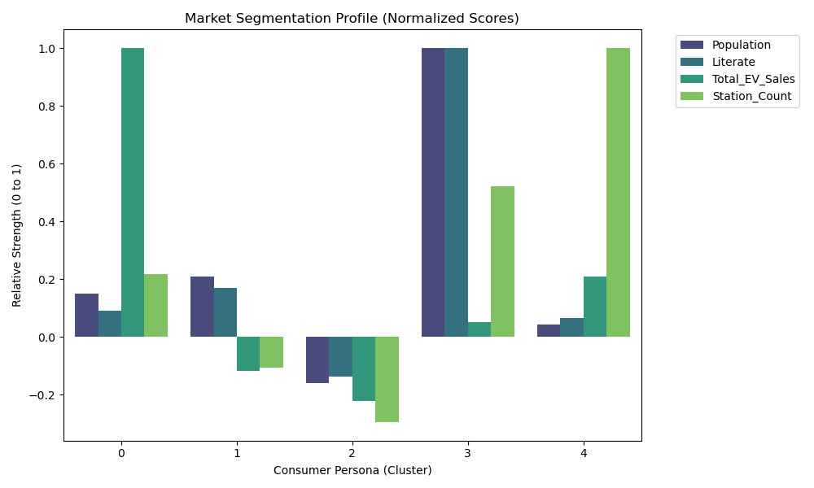

# EV-Strat: Electric Vehicle Market Intelligence System

A data-driven market segmentation and strategic analysis platform for the Electric Vehicle (EV) market in India, leveraging unsupervised machine learning techniques to identify high-growth opportunities.

## Project Overview

EV-Strat is a comprehensive market intelligence system that analyzes the EV market landscape across Indian districts using clustering algorithms and dimensionality reduction techniques. The project identifies distinct market segments and provides actionable strategic recommendations for EV market penetration.

## Key Features

- **Multi-Source Data Integration**: Combines EV sales data, census demographics, and charging station infrastructure data
- **Advanced Analytics**: Utilizes PCA (Principal Component Analysis) for dimensionality reduction
- **Market Segmentation**: K-Means clustering to identify 5 distinct consumer personas
- **Strategic Insights**: Data-driven recommendations for market targeting and infrastructure development
- **Interactive Dashboard**: Jupyter notebook-based executive dashboard for visualization


## Technology Stack

- **Python 3.9**
- **Data Processing**: pandas, numpy
- **Machine Learning**: scikit-learn
- **Visualization**: matplotlib, seaborn
- **Data Source**: Kaggle API
- **Environment**: Jupyter Notebook

## Installation

### Prerequisites
- Python 3.9 or higher
- Conda package manager
- Kaggle API credentials

### Setup Instructions

1. Clone the repository:
```bash
git clone https://github.com/yourusername/EV-Strat.git
cd EV-Strat
```

2. Create and activate the conda environment:
```bash
conda env create -f environment.yml
conda activate ev_strat_env
```

3. Configure Kaggle API credentials:
   - Create a `.env` file in the project root
   - Add your Kaggle credentials:
   ```
   KAGGLE_USERNAME=your_username
   KAGGLE_KEY=your_api_key
   ```

## Usage

### Running the Complete Pipeline

Execute the scripts in sequence:

```bash
# Step 1: Download data from Kaggle
python src/01_data_acquisition.py

# Step 2: Clean and merge datasets
python src/02_preprocessing.py

# Step 3: Perform PCA analysis
python src/03_pca_analysis.py

# Step 4: Run K-Means clustering
python src/04_clustering.py

# Step 5: Generate strategic insights
python src/05_market_insights.py
```

### Viewing the Dashboard

```bash
jupyter notebook notebooks/Executive_Dashboard.ipynb
```

## Data Sources

The project integrates three primary datasets from Kaggle:

1. **EV Sales Data**: Electric vehicle sales by state in India
   - Source: `mafzal19/electric-vehicle-sales-by-state-in-india`
   
2. **Census Data**: Indian census demographics
   - Source: `danofer/india-census`
   
3. **Charging Stations**: EV charging infrastructure locations
   - Source: `adityanerlekar31/ev-charging-stations-india`

## Methodology

### 1. Data Preprocessing
- Standardized column naming across datasets
- Aggregated EV sales and charging station counts by state
- Normalized features using StandardScaler
- Merged datasets on state-level geography

### 2. Dimensionality Reduction
- Applied PCA to reduce feature space while retaining 90% variance
- Reduced from 4 features to principal components
- Generated scree plot for variance analysis

### 3. Market Segmentation
- K-Means clustering with k=5 (validated using Elbow Method and Silhouette Score)
- Identified 5 distinct market segments across 640 districts

### 4. Strategic Analysis
- Profiled each cluster by average demographics and EV metrics
- Identified high-growth opportunity segments
- Generated actionable recommendations

## Key Findings

### Market Segmentation Results



The analysis identified strong correlations between:
- Population and Literacy (0.97)
- EV Sales and Charging Stations (0.53)

### Cluster Profiles



Five distinct market segments were identified:

| Cluster | Population | Literacy | EV Sales | Stations | Districts | Profile |
|---------|-----------|----------|----------|----------|-----------|---------|
| 0 | 0.60 | 0.39 | 2.46 | 0.43 | 71 | High Sales, Medium Infrastructure |
| 1 | 0.83 | 0.73 | -0.29 | -0.21 | 127 | High-Growth Opportunity |
| 2 | -0.63 | -0.60 | -0.55 | -0.58 | 338 | Rural/Low Adoption |
| 3 | 3.98 | 4.33 | 0.13 | 1.03 | 13 | Metro Leaders |
| 4 | 0.16 | 0.28 | 0.51 | 1.97 | 91 | Infrastructure Rich |

### Distribution Analysis



The boxplot analysis reveals:
- Cluster 3 (Metro Leaders) shows highest literacy and population density
- Cluster 1 represents the largest untapped market (127 districts)
- Significant infrastructure gaps exist in Clusters 1 and 2

### Clustering Validation



The optimal number of clusters (k=5) was determined through:
- Elbow Method: Identified inflection point at k=5
- Silhouette Score: Peak performance at k=5
- Business interpretability of resulting segments

### PCA Analysis


Principal Component Analysis results:
- PC1 and PC2 capture majority of variance
- 90% cumulative variance retained
- Effective dimensionality reduction from 4 to 2-3 components

### Market Opportunity



## Strategic Recommendations

### Primary Target: Cluster 1 (High-Growth Opportunity)

**Market Characteristics:**
- 127 districts (19.8% of India)
- High literacy rate (0.73) indicating market awareness
- Low current EV sales (-0.29) showing untapped potential
- Moderate infrastructure needs

**Recommended Actions:**
1. **Targeted Marketing Campaign**
   - Focus on educated, aware consumers
   - Emphasize total cost of ownership benefits
   - Leverage digital marketing channels

2. **Infrastructure Development**
   - Strategic placement of charging stations
   - Partnership with local governments
   - Incentivize private charging infrastructure

3. **Product Strategy**
   - Introduce affordable EV models
   - Flexible financing options
   - After-sales service network expansion

### Secondary Focus: Cluster 3 (Metro Leaders)

**Infrastructure Support:**
- Enhance existing charging network
- Support high-volume sales with robust infrastructure
- Premium product offerings for affluent consumers

## Visualizations

All generated visualizations are available in the `outputs/figures/` directory:

- `heatmap.png` - Feature correlation matrix
- `market_segments_map.png` - PCA-based cluster visualization
- `boxplot.png` - Distribution analysis by cluster
- `clustering_validation.png` - Elbow and Silhouette analysis
- `pca_scree_plot.png` - Variance explained by components
- `market_opportunity_chart.png` - Normalized cluster profiles

## Output Files

### Data
- `outputs/ev_market_clusters.csv` - Clustered dataset with segment assignments
- `data/processed/ev_market_final.csv` - Preprocessed and normalized data
- `data/processed/pca_output.csv` - PCA-transformed features

## Performance Metrics

- **Data Coverage**: 640 districts across 35 states
- **Feature Reduction**: 4 original features → 2-3 principal components (90% variance)
- **Segmentation Quality**: Silhouette Score optimized at k=5
- **Market Coverage**: 100% of Indian EV market geography

## Future Enhancements

- [ ] Time-series analysis for trend prediction
- [ ] Incorporation of economic indicators (GDP, income levels)
- [ ] Real-time data integration via APIs
- [ ] Interactive web dashboard using Plotly/Dash
- [ ] Predictive modeling for sales forecasting
- [ ] Competitive analysis integration
- [ ] Regional language support for reports

